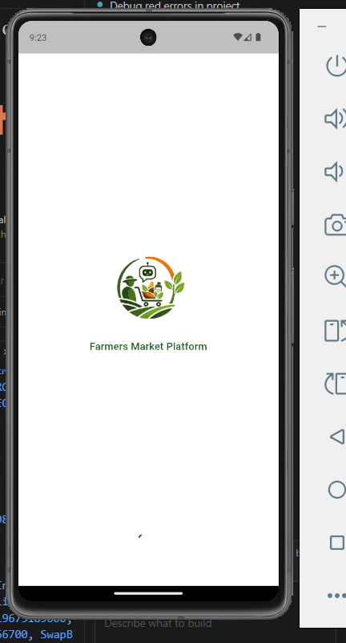
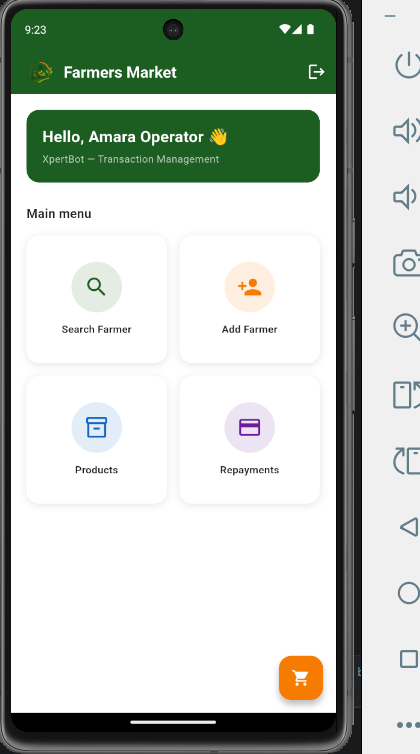
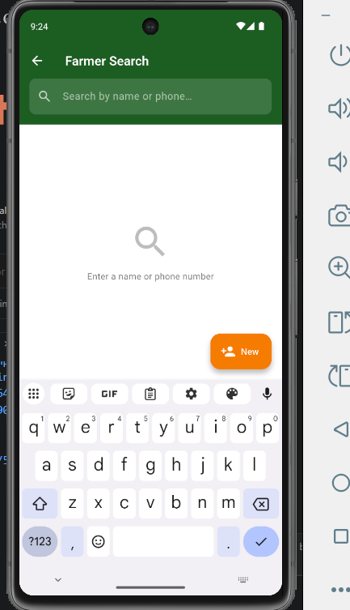
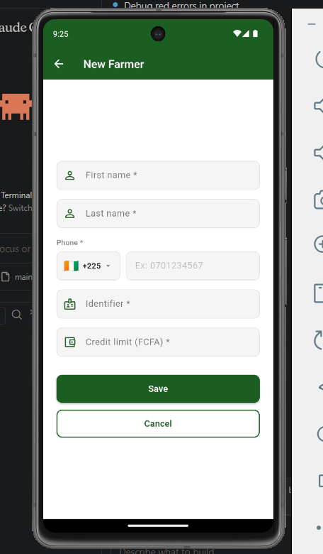
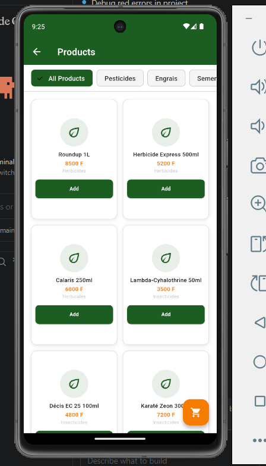
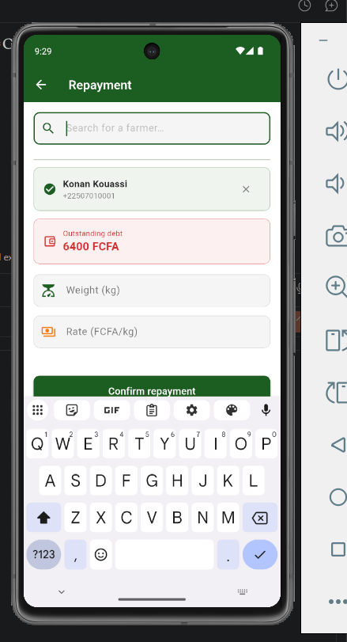

<div align="center">
  

  # 🌾 Farmers Market Platform — Frontend

  **Mobile POS operator app for an agricultural marketplace in Côte d'Ivoire**

  [](https://flutter.dev)
  [](https://dart.dev)
  [](https://riverpod.dev)
  [](LICENSE)

  [Live Demo](https://YOUR_GITHUB_USERNAME.github.io/farmers-market-platform) · [Backend Repo](https://github.com/YOUR_GITHUB_USERNAME/farmers-market-backend) · [Video Walkthrough](https://www.youtube.com/watch?v=YOUR_VIDEO_ID)
</div>

---

## 📋 Overview

Farmers Market Platform is a **Flutter-based Point-of-Sale (POS) application** built as part of the XpertBot Full Stack Developer Technical Assessment. It enables field operators at agricultural markets in Côte d'Ivoire to:

- Onboard and manage farmers
- Browse commodity products by category
- Process cash, mobile money, and credit transactions
- Record commodity repayments with automatic FCFA conversion
- Operate **fully offline** with automatic background sync when connectivity is restored

The app targets both phone and tablet form factors and is deployed as a Flutter Web application on GitHub Pages.

---

## ✨ Features

| Feature | Description |
|---|---|
| 🔐 **Authentication** | Secure login with JWT token stored via `flutter_secure_storage` |
| 🏠 **Dashboard** | Operator home screen with quick-access action cards |
| 🔍 **Farmer Search** | Real-time search with debounce, results list with debt indicators |
| 👨‍🌾 **Farmer Management** | Register new farmers, view full profile and debt summary |
| 🛒 **Product Catalog** | Browse products by nested categories with quantity selection |
| 💳 **Checkout** | Cart management with Cash / Credit payment modes |
| 💰 **Repayments** | Enter repayment in kg or FCFA with automatic unit conversion |
| 📶 **Offline Mode** | Queue transactions locally and sync automatically when back online |
| 🔄 **Background Sync** | Periodic connectivity check with sync status bottom sheet |

---

## 🛠 Tech Stack

| Layer | Technology | Version |
|---|---|---|
| Framework | Flutter | 3.10+ |
| Language | Dart | 3.0+ |
| State Management | flutter_riverpod | 3.3.1 |
| HTTP Client | Dio | 5.4.3 |
| Navigation | go_router | 17.2.2 |
| Secure Storage | flutter_secure_storage | 10.0.0 |
| Local Cache | shared_preferences | 2.2.3 |
| Connectivity | connectivity_plus | 7.1.1 |

---

## 📸 Screenshots

<table>
  <tr>
    <td align="center">
      
      <br/><b>Splash Screen</b>
    </td>
    <td align="center">
      
      <br/><b>Home Dashboard</b>
    </td>
    <td align="center">
      
      <br/><b>Farmer Search</b>
    </td>
  </tr>
  <tr>
    <td align="center">
      
      <br/><b>Register Farmer</b>
    </td>
    <td align="center">
      
      <br/><b>Product Catalog</b>
    </td>
    <td align="center">
      
      <br/><b>Repayments</b>
    </td>
  </tr>
</table>

---

## 🗂 Project Structure

```
lib/
├── core/
│   ├── constants/          # Colors, strings, API URLs
│   ├── exceptions/         # ApiException model
│   └── widgets/            # Reusable widgets (AppButton, AppTextField, AppLoader)
├── features/
│   ├── auth/
│   │   ├── data/           # AuthRepository (login/logout API calls)
│   │   ├── domain/         # UserModel
│   │   └── presentation/   # LoginScreen + AuthNotifier
│   ├── farmers/
│   │   ├── data/           # FarmersRepository
│   │   ├── domain/         # FarmerModel
│   │   └── presentation/   # Search, Create, Profile screens + FarmersNotifier
│   ├── home/
│   │   └── presentation/   # HomeScreen (dashboard)
│   ├── products/
│   │   ├── data/           # ProductsRepository
│   │   ├── domain/         # ProductModel
│   │   └── presentation/   # ProductsScreen, ProductDetailScreen + ProductsNotifier
│   ├── repayments/
│   │   ├── data/           # RepaymentsRepository
│   │   ├── domain/         # RepaymentModel
│   │   └── presentation/   # RepaymentScreen + RepaymentsNotifier
│   ├── sync/               # SyncNotifier + SyncStatusSheet (offline queue processor)
│   └── transactions/
│       ├── data/           # TransactionsRepository + OfflineQueue
│       ├── domain/         # TransactionModel, PendingTransaction
│       └── presentation/   # CartScreen, CheckoutScreen + CartNotifier, TransactionsNotifier
├── router/
│   └── app_router.dart     # go_router configuration + auth redirect guards
└── services/
    ├── api_service.dart         # Dio singleton with auth interceptor
    ├── connectivity_service.dart
    └── local_cache_service.dart # SharedPreferences wrapper
```

---

## ⚙️ Installation

### Prerequisites

Ensure you have the following installed:

- [Flutter SDK](https://docs.flutter.dev/get-started/install) **3.10+**
- [Dart SDK](https://dart.dev/get-dart) **3.0+** (bundled with Flutter)
- [Git](https://git-scm.com/)
- A device emulator or physical device

Verify your Flutter installation:

```bash
flutter doctor
```

### Clone the Repository

```bash
git clone https://github.com/justin4689/farmers-market-platform-frontend.git
cd farmers-market-platform-frontend
```

### Install Dependencies

```bash
flutter pub get
```

---

## 🔧 Environment & API Configuration

The API base URL is configured in [lib/core/constants/api_urls.dart](lib/core/constants/api_urls.dart):

```dart
// lib/core/constants/api_urls.dart
static String get baseUrl {
  if (kIsWeb) {
    return 'http://localhost:8000/api';      // Flutter Web (local dev)
  }
  return 'http://13.51.177.195/api';         // Mobile / Production (AWS)
}
```

| Environment | URL |
|---|---|
| Web (local dev) | `http://localhost:8000/api` |
| Mobile / Production | `http://13.51.177.195/api` |

To point to a different backend, update the `baseUrl` value in `api_urls.dart` before building.

---

## ▶️ Run Instructions

### Run on Device / Emulator

```bash
# List available devices
flutter devices

# Run on a specific device
flutter run -d <device_id>

# Run in debug mode (default)
flutter run

# Run in release mode
flutter run --release
```

### Run on Chrome (Web)

```bash
flutter run -d chrome
```

---

## 🌐 Build Web Instructions

```bash
# Build optimized web bundle
flutter build web --release

# Output is generated in build/web/
```

The `build/web/` directory is ready to be served from any static hosting provider.

---

## 🚀 Deployment

### GitHub Pages

1. Build the web release:

```bash
flutter build web --release --base-href "/farmers-market-platform/"
```

2. Copy the contents of `build/web/` to your `gh-pages` branch, or use the [gh-pages](https://www.npmjs.com/package/gh-pages) npm package:

```bash
# Using the gh-pages npm tool
npm install -g gh-pages
gh-pages -d build/web
```

3. Enable GitHub Pages in your repository settings → **Pages** → Source: `gh-pages` branch.

**Live URL:** `https://justin4689.github.io/farmers-market-platform/`

---

## 🔑 Demo Credentials

> Use these credentials to explore the app without creating an account.

| Role | Email | Password |
|---|---|---|
| Operator 1 | `operator1@xpertbot.com` | `password` |
| Operator 2| `operator2@xpertbot.com` | `password` |


---

## 🏛 Architecture

The project follows a **feature-first clean architecture** pattern:

```
Feature
├── data/         ← API calls, repository implementations, local queue
├── domain/       ← Pure Dart models (no Flutter dependencies)
└── presentation/ ← Riverpod Notifiers + Screens (UI only)
```

**Key architectural decisions:**

- **Riverpod** is the single source of truth for all state — no `setState` in business logic
- **ApiService** (Dio singleton) handles all HTTP with a token interceptor that auto-redirects on `401`
- **OfflineQueue** persists pending transactions to `SharedPreferences` and replays them via `SyncNotifier` when connectivity returns
- **go_router** redirect guards enforce the auth wall — unauthenticated routes resolve to `/login`
- Screens are **never** aware of the network layer; they observe notifier state only

---

## 🤖 AI Usage Report

| Task | Tool Used | How It Helped |
|---|---|---|
| Boilerplate generation | Claude (Anthropic) | Generated initial feature folder structures and Riverpod provider scaffolding |
| Offline queue design | Claude (Anthropic) | Suggested `SharedPreferences`-based queue with retry logic |
| Router configuration | Claude (Anthropic) | Helped set up `go_router` redirect guards for auth flow |
| UI layout refinement | Claude (Anthropic) | Iterated on responsive card layouts for tablet breakpoints |
| Debugging Dio interceptors | Claude (Anthropic) | Diagnosed token refresh race condition in auth interceptor |

All AI-generated code was reviewed, tested, and adapted to fit the specific requirements of this project.

---

## 🔭 Future Improvements

- [ ] **Push notifications** — Alert operators to pending sync failures or new assignments
- [ ] **Biometric login** — Fingerprint / Face ID for faster operator access
- [ ] **Export reports** — PDF/CSV export of daily transaction summaries
- [ ] **Multi-language support** — Add French (primary) and local language (Dioula) via Flutter's `intl` package
- [ ] **Dark mode** — Full dark theme respecting system preference
- [ ] **Unit & widget tests** — Increase test coverage to 80%+ for notifiers and repositories
- [ ] **Role-based UI** — Restrict admin-only actions based on JWT role claim
- [ ] **Image capture** — Allow operators to capture farmer ID photos at registration

---

## 👤 Author

**Justin Trah**
Full Stack Developer — XpertBot Technical Assessment (2026)

| | |
|---|---|
| 📧 Email | justintrah8@gmail.com |
| 🐙 GitHub | [github.com/justin4689](https://github.com/justin4689) |
| 🎬 Demo Video | [YouTube Walkthrough](https://www.youtube.com/watch?v=YOUR_VIDEO_ID) |
| 📝 Submission | [xpertbotacademy.online](https://xpertbotacademy.online/project-submission) |

---

<div align="center">
  Built with ❤️ using Flutter · Submitted May 2026 · XpertBot Academy
</div>
